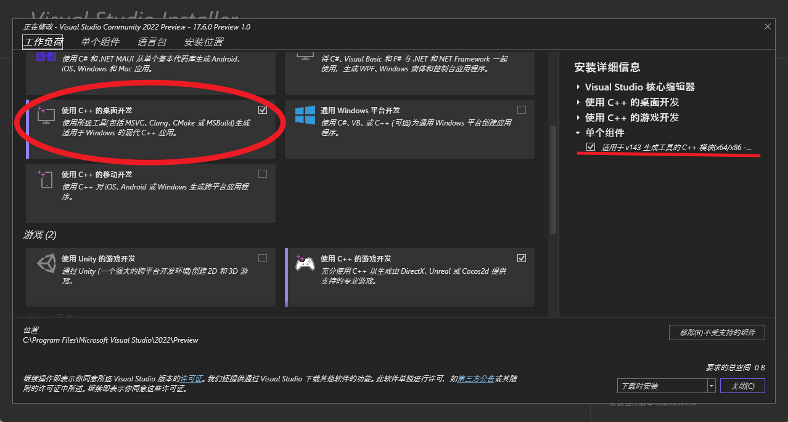
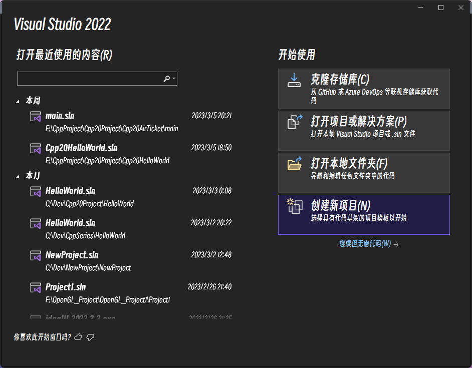
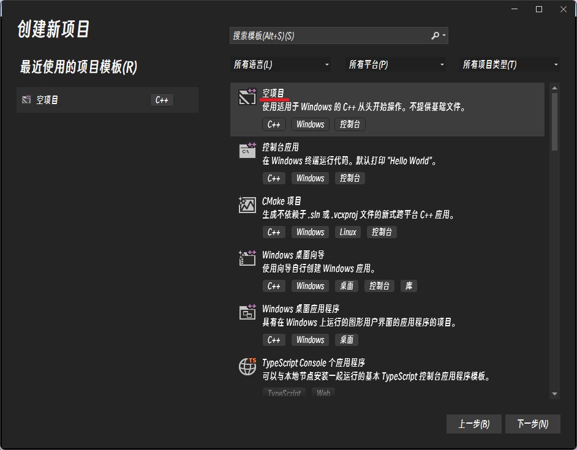
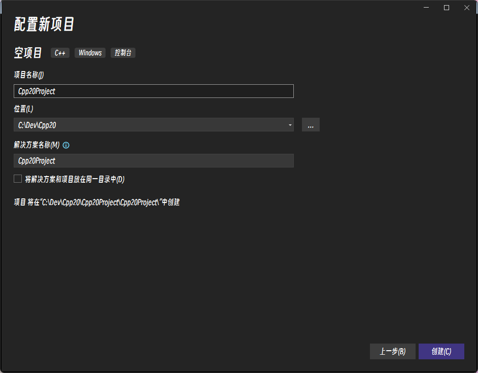
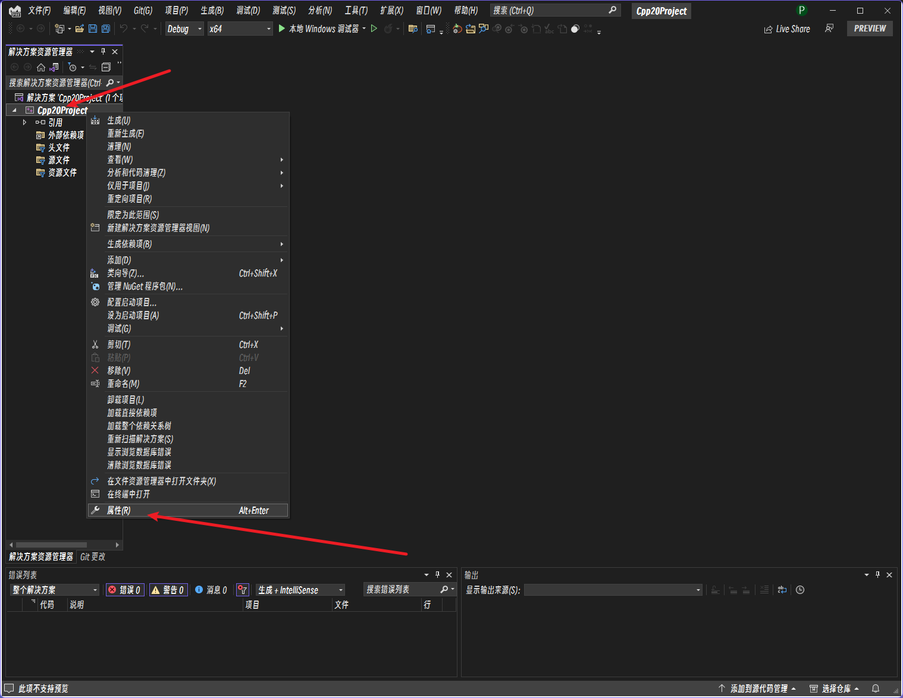
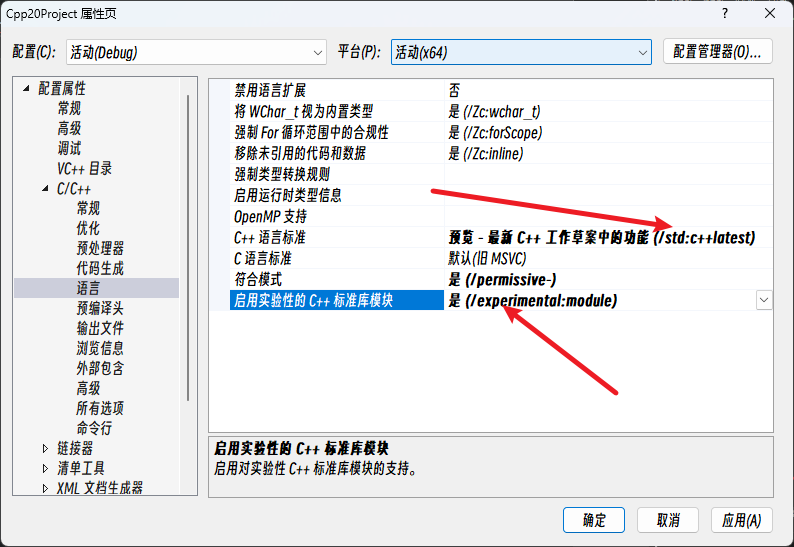
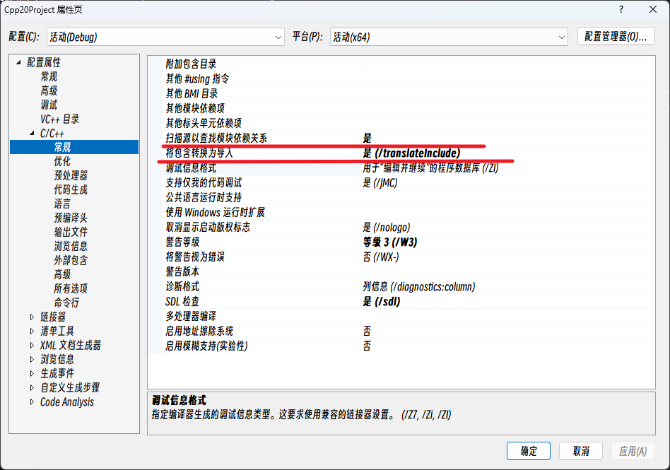
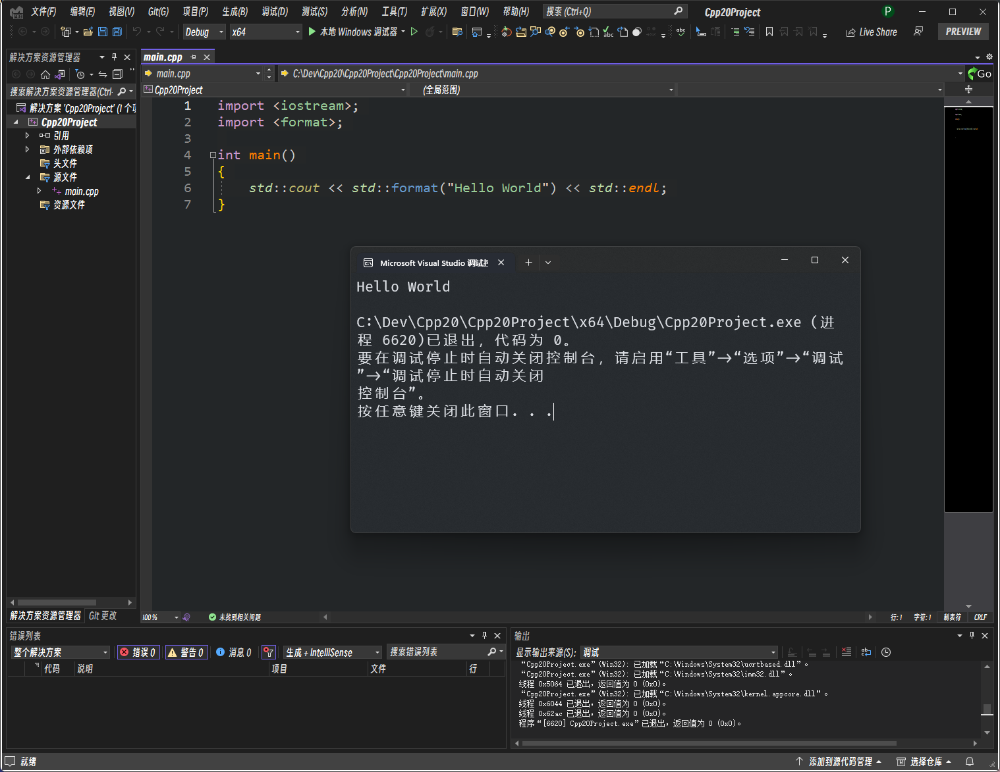

# 第0章 C++20环境配置

作者在配置C++20环境时踩了不少坑，至今也没有完全整明白，所以如果有人看到本文，还希望给予解决办法。

## 目录

[Windows配置](#Windows配置)

## Windows配置

windows是目前最容易安装并使用完整功能的环境了。

### 下载VS2022

[下载链接](https://visualstudio.microsoft.com/zh-hans/thank-you-downloading-visual-studio/?sku=Community&channel=Release&version=VS2022&source=VSLandingPage&cid=2030&passive=false)

```shell
https://visualstudio.microsoft.com/zh-hans/vs/
```


## 安装VS2022

在安装程序中选择<kbd>使用C++的桌面开发</kbd>以及在**单个组件**中搜索<kbd>C++模块</kbd>进行下载。



> 注：由于我之后还要学游戏开发，这里就顺便把游戏开发也勾上了。

## 创建空项目

在开始窗口选择<kbd>创建新项目</kbd>



随后选择<kbd>空项目</kbd>



设置项目名称、位置



右键<kbd>项目</kbd>并选择<kbd>属性</kbd>



在属性窗口中选打开<kbd>C/C++</kbd>-><kbd>语言</kbd>页面，将<kbd>C++语言标准</kbd>选择为**c++20**或**c++latest**，将<kbd>启用实验性的C++标准库模块</kbd>选择为**是**



在<kbd>常规</kbd>中将<kbd>将包含转换为导入</kbd>选择为**是**，将<kbd>扫描源以查找模块依赖关系</kbd>调整为**是**



将上述设置都设置完后就可以开始写代码了。

在解决方案资源管理器中右键源文件添加main.cpp

```cpp
import <iostream>;
import <format>;

int main()
{
	std::cout << std::format("Hello World") << std::endl;
}
```

编译后弹出窗口显示Hello World，成功！



> 问题1：打开**扫描源以查找模块依赖关系**后首次编译会异常的慢，但不打开又无法编译import`标准库头文件的代码，我觉得应该有解决方案，但我还没找到。
>
> 问题2：安装了VAX插件后，C++20的代码没有自动补全，有时候按<kbd>Tab</kbd>后就自动补全到其他代码了，不知道怎么解决。